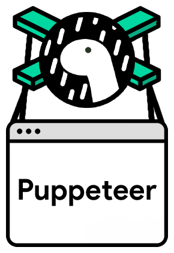

# deno-puppeteer



###### [API](https://github.com/puppeteer/puppeteer/blob/v9.0.1/docs/api.md)

A fork of [Puppeteer](https://pptr.dev/) running on Deno.

> Puppeteer is a library which provides a high-level API to control Chrome, Chromium, or Firefox Nightly over the DevTools Protocol. Puppeteer runs headless by default, but can be configured to run full (non-headless) Chrome or Chromium.

Most things that you can do manually in the browser can be done using Puppeteer! Here are a few examples to get you started:

- Generate screenshots and PDFs of pages.
- Crawl a SPA (Single-Page Application) and generate pre-rendered content (i.e. "SSR" (Server-Side Rendering)).
- Automate form submission, UI testing, keyboard input, etc.
- Create an up-to-date, automated testing environment. Run your tests directly in the latest version of Chrome using the latest JavaScript and browser features.
- Capture a timeline trace of your site to help diagnose performance issues.
- Test Chrome Extensions.

## Getting Started

### Installation

To use Puppeteer, import it like so:

```ts
import puppeteer from "https://deno.land/x/puppeteer@9.0.1/mod.ts";
```

Puppeteer can use any recent version of Chromium or Firefox Nightly, but this version of Puppeteer is only validated against a specific version. To cache these versions in the Puppeteer cache, run the commands below.

```shell
PUPPETEER_PRODUCT=chrome deno run -A --unstable https://deno.land/x/puppeteer@9.0.1/install.ts
PUPPETEER_PRODUCT=firefox deno run -A --unstable https://deno.land/x/puppeteer@9.0.1/install.ts
```

You can find all of the supported environment variables to customize installation [in the Puppeteer docs](https://pptr.dev/#?product=Puppeteer&version=v5.5.0&show=api-environment-variables).

### Usage

Puppeteer will be familiar to people using other browser testing frameworks. You create an instance of `Browser`, open pages, and then manipulate them with Puppeteer's API.

**Example** - navigating to https://example.com and saving a screenshot as _example.png_:

Save file as **example.js**

```js
import puppeteer from "https://deno.land/x/puppeteer@9.0.1/mod.ts";

const browser = await puppeteer.launch();
const page = await browser.newPage();
await page.goto("https://example.com");
await page.screenshot({ path: "example.png" });

await browser.close();
```

Execute script on the command line

```bash
deno run -A --unstable example.js
```

Puppeteer sets an initial page size to 800×600px, which defines the screenshot size. The page size can be customized with [`Page.setViewport()`](https://github.com/puppeteer/puppeteer/blob/v5.5.0/docs/api.md#pagesetviewportviewport).

**Example** - create a PDF.

Save file as **hn.js**

```js
import puppeteer from "https://deno.land/x/puppeteer@9.0.1/mod.ts";

const browser = await puppeteer.launch();
const page = await browser.newPage();
await page.goto("https://news.ycombinator.com", {
  waitUntil: "networkidle2",
});
await page.pdf({ path: "hn.pdf", format: "A4" });

await browser.close();
```

Execute script on the command line

```bash
deno run -A --unstable hn.js
```

See [`Page.pdf()`](https://github.com/puppeteer/puppeteer/blob/v5.5.0/docs/api.md#pagepdfoptions) for more information about creating pdfs.

**Example** - evaluate script in the context of the page

Save file as **get-dimensions.js**

```js
import puppeteer from "https://deno.land/x/puppeteer@9.0.1/mod.ts";

const browser = await puppeteer.launch();
const page = await browser.newPage();
await page.goto("https://example.com");

// Get the "viewport" of the page, as reported by the page.
const dimensions = await page.evaluate(() => {
  return {
    width: document.documentElement.clientWidth,
    height: document.documentElement.clientHeight,
    deviceScaleFactor: window.devicePixelRatio,
  };
});

console.log("Dimensions:", dimensions);

await browser.close();
```

Execute script on the command line

```bash
deno run -A --unstable get-dimensions.js
```

## FAQ

### How does deno-puppeteer compare to the Node version?

`deno-puppeteer` effectively runs a regular version of Puppeteer, except for some minor changes to make it compatible with Deno.

The most noticable difference is likely that instead of some methods taking / returning Node `Buffer`, they take / return `Uint8Array`.

Other than this, the documentation on https://pptr.dev generally applies.

### How to run in Docker?

An example Dockerfile can be found in this repository. It will install all necessary dependencies, and shows how to run the ./examples/docker.js.

It is just meant as a jumping off point - customize it as you wish.